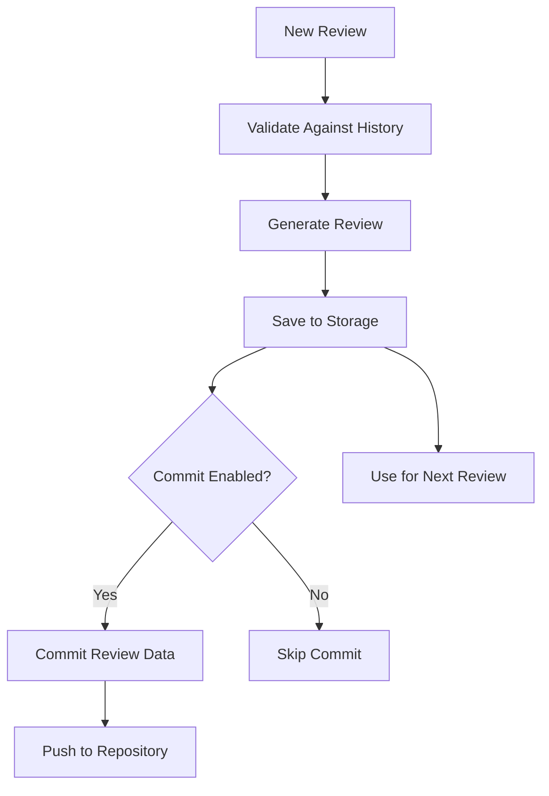

# Historical Learning & Review Data Management

CodeBunny learns from past reviews to provide better, more context-aware feedback over time. This document explains how review data is stored, committed, and used for validation.

## Overview



## Review Data Storage

### What Gets Stored

**Review Snapshots:**
- PR number, title, and author
- Review timestamp
- Approval state (MERGE, DON'T MERGE, etc.)
- Issues found (high, medium, low priority)
- Full review text
- Processing metrics

**Approval Transitions:**
- State changes over time
- Trigger type (new review, @codebunny mention, new commit)

### Storage Backends

#### File Storage (Default)
- Location: `.contributor/review-data.json`
- Limit: 100 reviews
- Committed: ✅ Yes (by default)

#### Turso Storage (Optional)
- Location: `.contributor/reviews.db` (local mode)
- Limit: ♾️ Unlimited
- Committed: ❌ No (database file is ignored)
- Synced: ✅ Yes (if using Turso cloud)

## Automatic Commits

### What Gets Committed

CodeBunny automatically commits review data after each review:

✅ **Committed:**
- Review summaries (`.contributor/reviews/pr-*.md`)
- File storage data (`.contributor/review-data.json`)

❌ **Not Committed (Ignored):**
- Turso database files (`.contributor/reviews.db*`)
- Backup files (`.contributor/review-data.json.backup`)

### Commit Behavior

By default, CodeBunny commits review data to your repository:

```yaml
- name: CodeBunny Review
  uses: bdougie/codebunny@v1
  with:
    continue-api-key: ${{ secrets.CONTINUE_API_KEY }}
    continue-org: ${{ vars.CONTINUE_ORG }}
    continue-config: ${{ vars.CONTINUE_CONFIG }}
    # commit-review-data: 'true' (default)
```

**Disable commits:**
```yaml
  with:
    commit-review-data: 'false'  # Don't commit review data
```

### Required Permissions

For auto-commits to work, your workflow needs write permissions:

```yaml
permissions:
  contents: write      # Required for committing review data
  pull-requests: write # Required for posting reviews
  issues: write        # Required for PR comments
```

### Commit Message Format

```
Update review data for PR #123: Add feature

Review data updated by CodeBunny for owner/repo#123

This commit includes:
- Review summaries in .contributor/reviews/
- Historical review metrics (if using file storage)

The Turso database (.contributor/reviews.db) is not committed and
should be synced via Turso cloud or backed up separately.

Generated with [Continue](https://continue.dev)

Co-Authored-By: Continue <noreply@continue.dev>
Co-authored-by: bdougieyo <brian@continue.dev>
```

## Historical Validation

### How It Works

Before generating a review, CodeBunny analyzes historical data to provide context:

**1. Find Similar PRs**
- By author (30% weight)
- By title keywords (40% weight)
- Returns top 5 similar PRs with similarity scores

**2. Identify Common Issues**
- Extracts issue patterns from past reviews
- Categorizes by priority (high, medium, low)
- Tracks frequency across reviews

**3. Analyze Approval Patterns**
- Author's historical approval rate
- Repository-wide approval trends
- Time to approval (if multiple reviews exist)

**4. Generate Recommendations**
- Warns about challenging PR patterns
- Highlights common codebase issues
- Provides author-specific insights

### Example Historical Context

When CodeBunny has historical data, reviews include a section like:

```markdown
## 📊 Historical Context

### Key Insights

⚠️ Similar PRs have had approval challenges. Pay extra attention to common patterns.
🔍 Common issues in this codebase: security, performance, test
✅ Author has strong track record (85% approval rate).

### Similar PRs

- ✅ PR #45: Add authentication middleware (75% similar)
- 🔄 PR #38: Refactor API routes (68% similar)
- ❌ PR #12: Update dependencies (52% similar)

### Common Issues in This Codebase

- 🔴 **security** (found in 12 reviews)
- 🟡 **performance** (found in 8 reviews)
- 🟡 **test** (found in 7 reviews)
- 🟢 **documentation** (found in 5 reviews)

*This analysis is based on historical review data stored in your repository.*
```

## Why This Matters

### Continuous Improvement

**Learning Loop:**
1. Review PR → Save data
2. Commit to repository
3. Use in future reviews
4. Improve over time

**Benefits:**
- More accurate recommendations
- Consistent feedback across PRs
- Identifies recurring issues
- Learns team patterns

### Team Knowledge Base

Review data becomes organizational knowledge:

- **New Contributors:** See how similar PRs were reviewed
- **Code Quality Trends:** Track improvements over time
- **Best Practices:** Learn from approved PRs
- **Common Pitfalls:** Avoid repeated mistakes

## Managing Review Data

### Viewing Review History

**Review Summaries:**
```bash
# View all review summaries
ls .contributor/reviews/

# Read specific PR review
cat .contributor/reviews/pr-123.md
```

**File Storage:**
```bash
# View all reviews (file storage)
cat .contributor/review-data.json | jq .
```

**Turso Storage:**
```bash
# Query review data
turso db shell file:.contributor/reviews.db

# Get all reviews
SELECT * FROM ReviewSnapshot ORDER BY timestamp DESC LIMIT 10;

# Get author statistics
SELECT prAuthor, COUNT(*) as reviews, AVG(CASE WHEN reviewState = 'MERGE' THEN 1.0 ELSE 0.0 END) as approvalRate
FROM ReviewSnapshot
GROUP BY prAuthor
ORDER BY reviews DESC;
```

### Backup Strategies

#### File Storage
```bash
# Commit to repository (automatic by default)
git add .contributor/review-data.json
git commit -m "Update review data"
```

#### Turso Storage

**Local Mode:**
```bash
# Backup database file
cp .contributor/reviews.db backups/reviews-$(date +%Y%m%d).db

# Or export to SQL
sqlite3 .contributor/reviews.db .dump > backup.sql
```

**Synced Mode:**
- Data automatically synced to Turso cloud
- Access from anywhere with auth token
- Built-in redundancy

### Cleaning Old Data

**File Storage:**
```javascript
// Automatically maintains 100-review limit
// Older reviews are removed automatically
```

**Turso Storage:**
```sql
-- Remove reviews older than 1 year
DELETE FROM ReviewSnapshot WHERE timestamp < date('now', '-1 year');

-- Remove reviews for deleted PRs
DELETE FROM ReviewSnapshot WHERE prNumber NOT IN (SELECT number FROM active_prs);

-- Vacuum to reclaim space
VACUUM;
```

## Privacy & Security

### Data Stored Locally

✅ All review data stays in your repository
✅ No external services (except optional Turso sync)
✅ Full control over data retention
✅ Can be deleted anytime

### Sensitive Data

⚠️ Review text may contain:
- Code snippets
- File names
- PR descriptions
- Commit messages

**Recommendations:**
- Don't commit sensitive information in PRs
- Review `.contributor/reviews/` before pushing
- Use Turso local mode for private data
- Set up `.gitignore` for sensitive patterns

### Turso Sync Security

When using Turso synced mode:
- ✅ Data encrypted in transit (TLS)
- ✅ Auth tokens for access control
- ✅ Can be self-hosted
- ✅ GDPR compliant

## Troubleshooting

### Commits Not Appearing

**Check permissions:**
```yaml
permissions:
  contents: write  # Required for commits
```

**Check if enabled:**
```yaml
with:
  commit-review-data: 'true'
```

**Check logs:**
```
💾 Committing review data to repository...
✅ Review data committed successfully
```

### Historical Context Not Showing

**Cause:** No historical data yet

**Solution:** First review builds baseline, subsequent reviews show context

### Storage Growing Large

**File Storage:** Automatically limited to 100 reviews

**Turso Storage:** 
- Use synced mode to move data to cloud
- Clean old data manually with SQL
- Database file is `.gitignore`d by default

## Best Practices

### For Teams

1. **Enable Turso Synced Mode** - Share review data across team
2. **Commit Review Summaries** - Track decisions over time
3. **Review Historical Insights** - Learn from past reviews
4. **Set Up Periodic Cleanup** - Remove old data

### For Solo Developers

1. **Use Local Turso Mode** - Unlimited history, zero cost
2. **Keep Commits Enabled** - Track your progress
3. **Review Your Patterns** - Identify areas for improvement
4. **Export Before Major Changes** - Backup review data

### For Organizations

1. **Centralize with Turso Cloud** - Team-wide analytics
2. **Analyze Cross-Repo Trends** - Identify common issues
3. **Share Best Practices** - Learn from approved PRs
4. **Track Code Quality Metrics** - Measure improvements

## Further Reading

- [Turso Setup Guide](TURSO_SETUP.md)
- [Storage Interface Documentation](storage/storage-interface.ts)
- [Review Metrics Documentation](review-metrics.ts)
